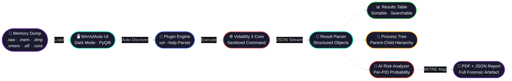
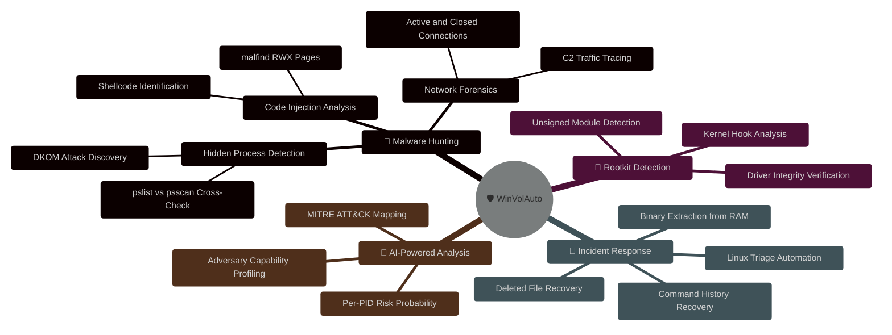
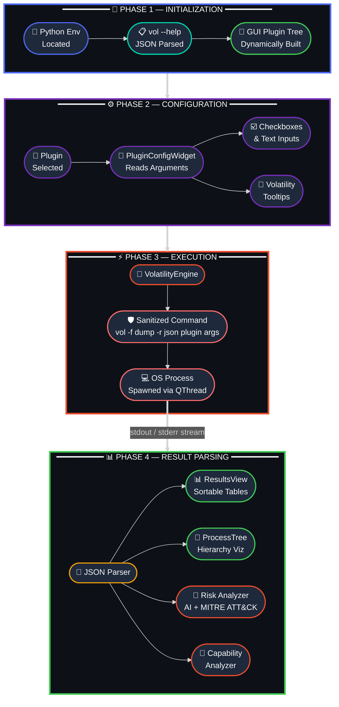
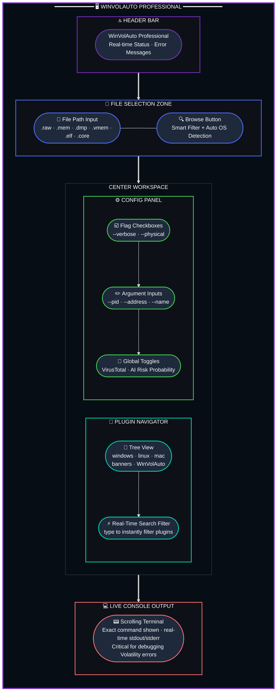

<div align="center">

<!-- Animated Header Banner -->


<!-- Animated Typing SVG -->
<a href="https://github.com/SKYLINE217/WinVolAuto-Memory-Forensics-Suite">
  
</a>

<br/>
<br/>
<br/>


<!-- Badges Row 1 — Stack -->


<br/>

<!-- Badges Row 2 — Quick Links -->
[](#-key-features)
[](#️-architecture--workings)
[](#️-installation--setup)
[](#-the-dashboard-a-detailed-tour)
[](#️-legal-disclaimer)

</div>

---

> [!CAUTION]
> **Authorization Required** — WinVolAuto is a specialized tool intended **exclusively** for authorized security research, digital forensics, and incident response. You **must** have explicit written permission to capture and analyze memory from any target system. The creators disclaim all liability for unauthorized use. Misuse may violate federal law (CFAA) and equivalent international statutes.

---

## 🌐 Overview

**WinVolAuto** is a powerful, user-friendly desktop application designed to make memory forensics simple, accessible, and highly efficient. Built on top of the industry-standard **Volatility 3** framework, it provides a sleek, modern interface for analyzing memory dumps from Windows, Linux, and Mac systems — **no command line required**.

Whether you are a seasoned malware analyst, a security researcher, or a student learning digital forensics, WinVolAuto handles the complexity for you, allowing you to focus on the results.

<div align="center">

| | |
|:---:|:---|
| 🧩 **Plugin Engine** | Dynamic — discovers every installed plugin automatically |
| 🖥️ **OS Support** | Windows · Linux · macOS memory dumps |
| 🤖 **AI Risk Scoring** | Per-PID probability + MITRE ATT&CK mapping |
| 📄 **Report Formats** | JSON + PDF with safe table rendering |
| ⚡ **Execution Model** | Non-blocking async via `QThread` |

</div>

### 🔄 End-to-End Analysis Pipeline

> From raw memory dump to AI-scored forensic report — every step visualised.



---

## 🚀 Key Features

<div align="center">

| Feature | Description |
|:---:|:---|
| 🖥️ **Professional Dark UI** | Crafted dark-themed interface (`#1e1e1e`, Segoe UI) built for long SOC sessions |
| 🔌 **Dynamic Plugin Discovery** | Queries `vol -h` on launch — auto-discovers every installed plugin including community ones |
| ⚙️ **Smart Context-Awareness** | Auto-detects OS from dump extension; adapts UI and plugin tree instantly |
| ⚡ **Non-Blocking Execution** | `QThread`-powered — queue multiple scans, browse results mid-scan, no freezes |
| 📝 **Automated Reporting** | Clean JSON + PDF reports with safe nested table rendering |
| 🔍 **Intelligent Search** | Real-time plugin filter — type `"net"` → instantly shows all network plugins |
| 🛡️ **AI Risk + Heuristics** | Heuristic scoring with per-PID AI probabilities; maps findings to MITRE ATT&CK |
| 🧭 **Capability Summary** | Adversary capability profiling: persistence · injection · evasion · C2 · exfiltration |
| 🧩 **Internal Triage Plugins** | Curated Windows & Linux plugins for instant, zero-config triage |

</div>

### 🧩 WinVolAuto Internal Plugin Reference

<table>
<tr>
<td width="50%">

**🪟 Windows Triage**

| Plugin | Purpose |
|---|---|
| `internal.win.cmdline` | Recover attacker-typed commands |
| `internal.win.pstree` | Visualize parent-child process hierarchy |
| `internal.win.kernel_scan` | Detect unauthorized kernel modifications |
| `internal.win.persistence_scan` | Identify persistence mechanisms |
| `internal.win.text_scan` | Locate & preview text files from RAM |

</td>
<td width="50%">

**🐧 Linux Triage**

| Plugin | Purpose |
|---|---|
| `internal.linux.pslist` | Flag `/tmp` & `/dev/shm` execution + root shells |
| `internal.linux.bash` | Summarize risky bash history (curl/wget/nc/base64) |
| `internal.linux.check_syscall` | Count hooked syscalls → rootkit detection |
| `internal.linux.elfs` | Flag ELF modules from transient folders |

</td>
</tr>
</table>

---

## 🎯 What Can It Do?

<div align="center">

> **Capability Map** — every forensic power WinVolAuto gives you, at a glance.



</div>

### Real-World Use Cases

> **🦠 Malware Hunting** — Use `windows.pslist` + `windows.psscan` cross-comparison to expose DKOM-hidden processes. Run `windows.malfind` to find RWX memory pages with injected shellcode. Enable AI Risk Probability to rank all PIDs by threat score — investigate highest-risk processes first.

> **🔩 Rootkit Detection** — Analyze kernel modules and loaded drivers to find unauthorized system modifications. Spot unsigned or suspicious kernel extensions that standard AV misses.

> **🚨 Incident Response** — Extract full console command history to reconstruct attacker TTPs. Dump `.exe`/`.dll` binaries directly from RAM for offline reverse engineering, even after disk deletion. Use `internal.win.text_scan` to preview text artifacts still resident in memory.

> **🐧 Linux Forensics** — Instantly triage Linux memory for `/tmp` execution, risky bash history, hooked syscalls, and suspicious ELF modules loaded from transient directories.

---

## 🏗️ Architecture & Workings

### 🗺️ System Workflow — 4-Phase Internal Pipeline

> How WinVolAuto transforms a raw memory dump into actionable forensic intelligence — phase by phase.



### The 4-Phase Pipeline — Summary

<table>
<tr>
<td width="20%" align="center">🚀<br/><strong>Phase 1</strong><br/>Init</td>
<td width="80%">App launches, locates Python env, executes <code>vol.exe --help</code> in a hidden process, parses all plugin JSON descriptors, and dynamically builds the full GUI tree.</td>
</tr>
<tr>
<td align="center">⚙️<br/><strong>Phase 2</strong><br/>Config</td>
<td>When you select a plugin (e.g., <code>windows.pslist</code>), <strong>PluginConfigWidget</strong> reads its required arguments and dynamically generates checkboxes for boolean flags and text fields for string arguments — with hover tooltips from Volatility's own help text.</td>
</tr>
<tr>
<td align="center">⚡<br/><strong>Phase 3</strong><br/>Execute</td>
<td><strong>VolatilityEngine</strong> constructs a sanitized, safe command: <code>vol.exe -f &lt;dump&gt; -r json &lt;plugin&gt; &lt;args&gt;</code>, spawns it as a separate OS process, and captures stdout/stderr in real-time streams. The UI stays fully responsive via <code>QThread</code>.</td>
</tr>
<tr>
<td align="center">📊<br/><strong>Phase 4</strong><br/>Parse</td>
<td>Raw JSON → <strong>ResultsView</strong> (sortable tables) + <strong>ProcessTree</strong> (parent-child hierarchy) + <strong>Risk Analyzer</strong> (AI probabilities, MITRE ATT&CK mapping) + <strong>Capability Analyzer</strong> (persistence · injection · evasion · C2 · exfiltration).</td>
</tr>
</table>

---

## 🛠️ Installation & Setup

### Prerequisites

| # | Requirement | Notes |
|---|---|---|
| 1 | **Python 3.10+** | Modern language features required |
| 2 | **Volatility 3** | Core forensics engine |
| 3 | **Visual C++ Redistributable** | Windows only — prevents DLL load failures |

### Quick Start

```bash
# 1. Clone the repository
git clone https://github.com/SKYLINE217/WinVolAuto-Memory-Forensics-Suite.git
cd WinVolAuto-Memory-Forensics-Suite

# 2. Install Volatility 3 (the forensics engine)
pip install volatility3

# 3. Install Python dependencies (PyQt6 + helpers)
pip install -r requirements.txt

# 4. Launch WinVolAuto
python main.py
```

> [!TIP]
> On first launch, WinVolAuto will auto-query your Volatility installation to build the plugin tree. This takes a few seconds — subsequent launches are instant.

---

## 📊 The Dashboard: A Detailed Tour

### 🖼️ UI Zone Layout — Visual Map

> Every panel in the WinVolAuto interface and how it connects to your investigation workflow.



| Zone | What It Does |
|:---:|:---|
| 🔝 **Header** | Displays app title and real-time status bar (Scanning… / Ready / Error) |
| 📂 **File Zone** | Browse button with smart format filter; auto-detects Windows vs Linux context on selection |
| 🌳 **Plugin Tree** | Hierarchical navigator: `windows` · `linux` · `mac` · `banners` · WinVolAuto internal plugins |
| 🔍 **Search Filter** | Type `"net"` → instantly isolates `windows.netscan`, `linux.netstat`, etc. |
| ⚙️ **Config Panel** | Dynamic per-plugin argument UI with Volatility-sourced tooltips; VT + AI toggles |
| 💻 **Live Console** | Real-time scrolling terminal — shows exact command run + raw error output for debugging |

---

## 🐧 Supported OS & File Types

<div align="center">

| OS | File Extensions | Notes |
|:---:|:---|:---|
| 🪟 **Windows** | `.raw` `.mem` `.dmp` `.vmem` | Full plugin support — `pslist` · `cmdline` · `filescan` · `hivescan` + more |
| 🐧 **Linux** | `.elf` `.core` | Requires kernel-matched symbol table in `volatility3/symbols/` |
| 🍎 **macOS** | `.mem` `.raw` | Standard plugins via `mac` category |

</div>

> [!IMPORTANT]
> **Linux Symbol Tables** — Linux memory forensics is kernel-version specific. You must generate a symbol file for the exact kernel of the target machine using `dwarf2json`, then place the resulting JSON in your `volatility3/symbols/` directory.

---

## ❓ Troubleshooting

<details>
<summary><strong>🔴 "Unsatisfied requirement: symbol_table_name" (Linux)</strong></summary>

**Problem:** Scanning a Linux `.elf` file without a matching kernel symbol table.  
**Solution:** Run `dwarf2json` on the original Linux machine to generate kernel JSON symbols. Place the output in `volatility3/symbols/`. The filename must match the kernel version string.

</details>

<details>
<summary><strong>🔴 "vol.exe not found"</strong></summary>

**Problem:** WinVolAuto cannot locate the Volatility executable in your PATH.  
**Solution:** Run `pip install volatility3`. The app searches your Python `Scripts` directory automatically.

</details>

<details>
<summary><strong>🔴 "DLL Load Failed" (Windows)</strong></summary>

**Problem:** Missing Visual C++ Redistributables.  
**Solution:** Download and install the latest **Microsoft Visual C++ Redistributable** from the official Microsoft website.

</details>

<details>
<summary><strong>🔴 "PDF cell too large"</strong></summary>

**Problem:** Very large result sets caused cell overflow in generated PDF reports.  
**Solution:** This is handled automatically — reports now render nested tables and truncated previews for large lists and dictionaries, preventing overflow.

</details>

---

## ⚖️ Legal Disclaimer

> [!WARNING]
> **WinVolAuto** is a specialized tool intended **only** for authorized security research, digital forensics, and incident response activities.
>
> - **Authorization**: You must have **explicit written permission** to capture and analyze the memory of any system you target.
> - **Liability**: The creators of WinVolAuto are **not liable** for any misuse of this software or for any damage caused by its operation.
> - **Compliance**: Users are solely responsible for complying with all applicable local, state, and federal laws regarding data privacy and computer security.

---

<div align="center">


**Developed for the Cyber Security Community** 🛡️

[](https://github.com/SKYLINE217)


*Built with ❤️ for digital forensics investigators everywhere.*

</div>

